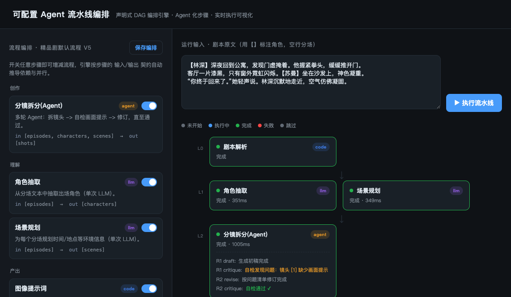

# 可配置 Agent 流水线编排引擎 · 技术方案

> 本方案对应两个业务诉求的最小化可运行 Demo：
> 1. **流程化配置 / 编排能力** —— 让业务能自由增减、开关、重排处理环节；
> 2. **Agent 能力改造** —— 把"单次 LLM"环节升级为"会自检的多轮 Agent"。
>
> Demo 位于本项目（`agent-demo`），**全部能力（含真实 LLM 与真实生图）均在本项目内自包含实现，
> 与 `` 零耦合**（不 import 其任何代码，仅复刻其调用协议）。前后端、CLI 均已用
> **真实 Gemini + portrait_gen 生图网关**端到端跑通，可一键复现。
>
> - LLM：Gemini `gemini-3.1-pro-preview`（Vertex AI，多 key 轮询，结构化 JSON 输出）；
> - 生图：portrait_gen 网关（`gpt-image-2`），提交 + 轮询，进程内信号量限流；
> - Agent 回环：**LangGraph `StateGraph`** 驱动 draft → critique → revise。

---

## 1. 背景与目标

现有精品剧生产流水线（`pipeline_runner`）把**阶段顺序、分组、调用关系全部写死在代码里**，
新增/调整一个环节都要改编排代码、重新发版；同时分镜拆分等环节是"一次 LLM 出全部字段"，
缺乏自检与修订能力，质量不稳定。

本方案给出两层解法，并用一个最小 Demo 验证可行性：

| 诉求 | 解法 | 关键词 |
|------|------|--------|
| 流程可配置 | **声明式 DAG 编排引擎** | Step Registry + IO 契约 + 通用执行器 |
| Agent 化 | **AgentStep 契约 + critic 回环** | draft → critique → revise |

一句话定位：**编排引擎是"骨架"，Agent 步骤是"肌肉"** —— 二者共用同一套 Step 抽象与执行引擎。

---

## 2. 总体架构

分层架构见 `assets/agent-pipeline-arch.drawio`（第 1 页 `Architecture`）。

```
前端层      编排配置面板 / 步骤注册表浏览 / 实时执行可视化(SSE)
接口层      GET /steps · GET·PUT /templates · POST /runs · GET /runs/{id}/events
编排引擎层  Step Registry(IO契约) · DAG依赖推导 · 通用执行器(分波并发) · RunContext(黑板) · 事件总线
步骤/Agent  code(剧本解析) · llm(角色抽取/场景规划/图像提示词) · agent(分镜拆分·LangGraph回环) · io(关键帧生图)
服务层      llm_client(Gemini·多key轮询) · image_client(portrait_gen网关·进程内信号量)  ← 自包含，零耦合
持久化层    MySQL(template / run / step_run) · Redis(可选)
横切        可观测性：loguru 日志 · trace_id · 步骤状态/耗时 · SSE 实时事件
```

### 2.1 三层核心抽象（对应"流程可配置"）

1. **Step Registry（步骤注册表）** —— 每个处理环节声明成一个 `Step`，显式声明
   `inputs` / `outputs`（黑板 key）与 `kind`（code/llm/agent）。
   `@register_step` 装饰器在 import 时登记进进程级注册表。
2. **Pipeline Template（流程模板）** —— DAG 以**数据**形式存库（`{"nodes":[{key,enabled}]}`），
   版本化。业务在前端开关/增减步骤即改流程，**无需改编排代码**。
3. **通用执行器（Executor）** —— 不关心具体业务：
   - 仅在"启用的步骤"之间，按 `outputs → inputs` **自动推导依赖**；
   - 拓扑分波，波内 `asyncio.gather` **并发执行**；
   - 缺少上游产物的步骤自动 **skipped**，不阻塞其它分支；
   - 每个步骤独立 `RunContext`（共享黑板），状态落库 + SSE 广播。

### 2.2 Agent 化契约（对应"Agent 能力改造"）

`AgentStep` 基类用 **LangGraph `StateGraph`** 把"生成-校验-修订"固化成统一状态机回环，
子类只实现 4 个钩子：

```
draft(ctx)               -> 初稿                         # 节点：draft
critique(ctx, draft)     -> CritiqueResult(passed, issues) # 节点：critique
revise(ctx, draft, issues) -> 修订稿                      # 节点：revise
finalize(ctx, draft)     -> 写回黑板的产物
```

状态图：`draft → critique →(条件边)`：`passed` → END；超 `max_rounds` → `give_up` → END；
否则 → `revise → critique`（回环）。`分镜拆分` 步骤的 draft/critique/revise **都是真实 Gemini 调用**，
critique 先做确定性本地校验（image_hook 是否齐备）再交模型做语义质检，省 token 也更稳。

任何"单次 LLM"环节都能低成本升级为 Agent，且对执行引擎完全透明——
引擎对 code / llm / agent / io **一视同仁地编排、记录状态、推流**。

运行时流程（含 critic 回环）见 `assets/agent-pipeline-arch.drawio`（第 2 页 `Runtime-Flow`）。

### 2.3 编排「注册 → 配置 → 执行」时序

完整时序见 `assets/agent-pipeline-arch.drawio`（第 3 页 `Registration-to-Execution`）。三个阶段：

1. **注册阶段（进程 import 时）**：各 step 模块顶部的 `@register_step` 在 import 时实例化并登记进 `STEP_REGISTRY`，
   每个 Step 携带 `inputs/outputs/kind` 的 IO 契约——这是后续依赖推导与前端分层的唯一数据来源；
2. **配置阶段**：前端拉取注册表渲染步骤卡片；`ensure_default_template` 把「注册表」翻译成默认 DAG 入库，
   业务开关/增减步骤 → `PUT /templates` 版本化保存（**数据即流程，不改代码**）；
3. **执行阶段**：`POST /runs` 建运行并 `create_task` 后台执行后立即返回 `run_id`；执行器按 IO 契约推导依赖、
   拓扑分波并发；Agent 步骤走 LangGraph 回环；每步写黑板 + 落库 + 经 `RunBroker` 推 SSE，前端实时可视化。

```mermaid
sequenceDiagram
    autonumber
    participant UI as 前端 UI
    participant API as API 接口层
    participant SVC as PipelineService
    participant REG as STEP_REGISTRY
    participant EXE as PipelineExecutor
    participant STP as Step/AgentStep(+LLM/生图)
    participant SSE as RunBroker(SSE)
    participant DB as MySQL

    Note over REG: ① 注册（import 时）@register_step 登记 Step(IO 契约)

    rect rgb(235,245,235)
    Note over UI,DB: ② 编排配置阶段
    UI->>API: GET /steps
    API->>SVC: list_steps()
    SVC->>REG: 读取注册表
    REG-->>UI: StepInfo[]（kind/inputs/outputs）
    UI->>API: GET /templates
    API->>SVC: ensure_default_template()
    SVC->>REG: 按注册表推导默认 DAG
    SVC->>DB: 落库 / 同步新增步骤
    DB-->>UI: 默认模板 nodes:[{key,enabled}] → 前端分层 L0..Ln
    UI->>API: PUT /templates（开关/增减步骤）
    API->>SVC: update_template() version+1
    SVC->>DB: 保存 DAG（数据即流程）
    end

    rect rgb(255,240,225)
    Note over UI,DB: ③ 执行阶段
    UI->>API: POST /runs
    API->>SVC: create_run()
    SVC->>DB: 建 PipelineRun(pending)
    SVC->>SVC: enabled=启用项; create_task(_execute)
    API-->>UI: run_id（立即返回）
    UI->>SSE: GET /runs/{id}/events（订阅+回放）
    SVC->>EXE: executor.run(enabled)〔后台〕
    EXE->>EXE: build_dependencies → 拓扑分波
    loop 每一波 while 未完成
        EXE->>STP: 并发 _run_one → step.run(ctx)
        STP->>STP: agent: draft→critique→(revise↺)→通过✓
        STP->>DB: 写黑板 + record step_run
        STP->>SSE: emit step_*/agent_round/keyframe
        SSE-->>UI: SSE 实时下发
    end
    EXE->>DB: run completed + blackboard
    EXE->>SSE: emit run_finished
    SSE-->>UI: run_finished（流结束）
    end
```

---

## 3. Demo 实现说明

### 3.1 代码结构（仅新增/改动）

```
app/engine/                 # 编排引擎内核
├── registry.py             # StepMeta + PipelineStep + register_step + STEP_REGISTRY
├── context.py              # RunContext（黑板 + emit 事件）
├── agent.py                # AgentStep 基类（LangGraph StateGraph critic 回环）
├── prompts.py              # 提示词 + 结构化输出 Schema 配置中心（提示词可配置化）
├── executor.py             # 通用 DAG 执行器（依赖推导 + 分波并发 + skip）
└── steps/                  # 示例步骤（层级 L0..Ln 由 IO 契约自动推导，非写死）
    ├── text_utils.py       # 纯代码文本工具（无 LLM）
    ├── script_ingest.py    # 剧本解析 (code)        out: episodes
    ├── char_extract.py     # 角色抽取 (llm·真实)     in: episodes  out: characters
    ├── scene_plan.py       # 场景规划 (llm·真实)     in: episodes  out: scenes
    ├── beat_split.py       # 分镜拆分 (agent·真实)   in: episodes,characters,scenes  out: shots
    ├── image_prompt.py     # 图像提示词 (llm·真实)   in: shots,characters  out: image_prompts
    ├── keyframe_render.py  # 关键帧生图 (io·真实)    in: image_prompts  out: keyframes
    ├── summary.py          # 剧情摘要 (code·默认关闭) in: episodes  out: summary
    ├── final_montage.py    # 成片合成 (code·默认关闭) in: shots,keyframes  out: montage（演示新增 L5）
    └── generic.py          # GenericLLMStep：档位 C 数据化通用步骤（IO/提示词来自模板，前端零代码新增）
app/services/llm_client.py  # ★ 真实 Gemini 客户端（自包含，多 key 轮询，结构化 JSON）
app/services/image_client.py# ★ 真实 portrait_gen 生图客户端（自包含，提交+轮询，信号量限流）
app/models/pipeline.py      # PipelineTemplate / PipelineRun / PipelineStepRun
app/schemas/pipeline.py     # 对外 Pydantic 模型
app/services/pipeline.py    # 注册表查询 / 模板CRUD / 运行调度 / SSE 广播
app/api/v1/endpoints/pipeline.py  # 接口层（含 SSE）
app/static/index.html       # 单页前端（编排配置 + 实时执行可视化 + 关键帧画廊）
scripts/run_agent_pipeline_demo.py  # 无头 CLI：复用同一引擎跑全链路（含 --no-image 开关）
```

由此自动推导出的默认 DAG（角色抽取与场景规划**并行**，分镜拆分三路汇聚）：

```
script_ingest ──┬─→ char_extract ─┐
                └─→ scene_plan ────┼─→ beat_split(Agent) ─→ image_prompt ─→ keyframe_render(真实生图)
                                   ┘
(summary 默认关闭，前端可一键开启后自动并入 DAG)
```

### 3.2 接口一览

| 方法 | 路径 | 说明 |
|------|------|------|
| GET | `/api/v1/pipeline/steps` | 步骤注册表（前端渲染步骤卡片） |
| GET | `/api/v1/pipeline/templates` | 模板列表（含 DAG 配置） |
| PUT | `/api/v1/pipeline/templates/{id}` | 保存编排（开关/增减步骤，版本+1） |
| POST | `/api/v1/pipeline/runs` | 触发一次运行（后台 asyncio 执行） |
| GET | `/api/v1/pipeline/runs/{id}` | 运行详情（各步骤状态 + 黑板产物） |
| GET | `/api/v1/pipeline/runs/{id}/events` | **SSE** 实时事件流（含 Agent 多轮自检） |

### 3.3 前端效果



- 左侧：步骤卡片（按 `code/llm/agent/io` 着色），开关即增减流程，"保存编排"版本化入库；
- 右侧：按依赖自动分层的 DAG（L0→L1 并行→L2→L3→L4），执行时节点实时变色；
- `分镜拆分(Agent)` 节点实时展示 critic 回环：`R1 draft → R1 critique(通过 ✓)`（有问题时会回环 revise）；
- `关键帧生图` 完成后，下方**关键帧画廊**实时展示真实生成的图片缩略图；
- 底部**实时活动日志**滚动展示每个步骤的 LLM/生图进度。

---

## 4. 关键工程要点（Demo 中已踩坑并修复）

1. **SSE 必须用纯 ASGI 中间件**：`BaseHTTPMiddleware` 会缓冲流式响应，导致事件无法实时下发；
   已将 `RequestLoggingMiddleware` 改为纯 ASGI 中间件透传 send/receive。
2. **后台任务要持有强引用**：`asyncio.create_task` 只被事件循环弱引用，
   不持有会被 GC 提前回收导致运行"卡在 pending"；已用模块级 set 持有。
3. **并发步骤的 DB 写入需串行化**：同一 `AsyncSession` 不能被并发步骤同时 commit，
   已用 `asyncio.Lock` 串行化落库。
4. **事件 step_key 不能走共享 ctx**：并发步骤共享 `current_step` 会串台，
   已为每个步骤创建独立 `RunContext`（共享同一黑板）。
5. **同步 SDK 不能阻塞事件循环**：google-genai SDK 为同步实现，
   `generate_json` 把整个 SDK 调用放进 `asyncio.to_thread`；多 key 轮询单 key 失败自动切换。
6. **生图并发用进程内信号量替代跨 Pod Redis**：Demo 自包含，无需 platform 的跨副本 Redis 信号量，
   用 `asyncio.Semaphore(IMAGE_GEN_CONCURRENCY)` 即可限流；生图为长任务（提交+轮询），
   `keyframe_render` 默认只渲染前 N=3 个镜头以控制时长/成本（可经 `params.max_keyframes` 调整）。

---

## 5. 真实能力接入：自包含 + 零耦合

**约束**：所有实现都在 `agent-demo` 内，**不 import `` 任何模块**，仅复刻其对外协议。

| 能力 | 本项目实现 | 协议来源（仅复刻，不依赖） |
|------|-----------|--------------------------|
| LLM | `app/services/llm_client.py` | Gemini via `google-genai`，`Client(api_key, vertexai=True)`，`response_schema` 结构化输出 |
| 生图 | `app/services/image_client.py` | portrait_gen 网关：`POST /api/v2/generate_image`（header `gpus_id:1`）→ `data.task_id`；`GET /api/v2/task/{id}/download?model_id=...` 轮询 → `data.images[0]` |

- **提示词配置化**：每个 LLM 环节的 system / user 提示词与输出 Schema 集中在 `app/engine/prompts.py`，
  业务调整提示词无需改编排或步骤代码（对应"提示词提取到配置"诉求）。
- **配置注入**：`.env` 提供 `GOOGLE_API_KEYS`(多 key CSV)、`GEMINI_BACKEND`、`LLM_MODEL`、
  `LLM_THINKING_LEVEL`、`PORTRAIT_GEN_BASE_URL/PROVIDER/MODEL_ID/MODEL`、`IMAGE_*` 等，
  全部由本项目 `app/core/config.py` 的 `Settings` 管理。
- **解耦收益**：本 Demo 可独立部署、独立演进；要替换底层模型/网关，只改本项目的两个 client 即可。

### 实测结果（端到端，真实调用）

| 路径 | 结果 |
|------|------|
| CLI `--no-image`（纯 LLM 链路） | 5 步全绿，约 33s；并行分支 + Agent 回环正常 |
| CLI 全链路（含真实生图 2 帧） | 7 步全绿，约 100s；产出 2 张真实图片 OSS URL |
| HTTP + SSE 全链路（含真实生图 3 帧） | 事件实时增量下发，产出 3 张真实图片；前端画廊正常展示 |

---

## 6. 可扩展性：如何插入新流程 / 新增一层（L5）

> 这是最常被问到的问题：**「L0~L4 是不是写死的？我想新增一个流程插进去、或新增一个 L5 怎么办？」**

**先澄清一个关键点：L0~L4 不是写死的层级，而是引擎按 IO 契约（`outputs → inputs`）实时拓扑分波算出来的。**
前端 `layers()` 与执行器 `build_dependencies()` 用的是同一套推导规则：

- L0 = 无依赖的步骤（`script_ingest`）；
- L1 = 依赖 `episodes` 的（`char_extract`、`scene_plan`，自动并行）；
- L2 = `beat_split`（三路汇聚）→ L3 = `image_prompt` → L4 = `keyframe_render`。

所以「层级」是产物依赖关系的副产品，**没有任何一行代码写死 L0..L4**。开关（`enabled`）只是「这一格要不要参与」，
而**真正的「插入/重排/新增一层」靠的是 IO 契约**——这正是声明式编排相对「写死顺序」的核心优势。

### 6.1 三档灵活度（按改动成本递增）

| 档位 | 诉求 | 做法 | 是否改引擎 | 是否需发版 |
|------|------|------|-----------|-----------|
| **A. 开关 / 重排现有步骤** | 临时增减一格 | 前端开关 → `PUT /templates` | 否 | 否 |
| **B. 新增一个流程 / 新增一层 L5** | 加一种新处理环节 | 新增一个 Step 文件（声明 IO 契约）→ 自动入 DAG | **否** | 是（加了 .py） |
| **C. 业务零代码自助加步骤** | 运营态不发版也能加 | 「声明式通用 Step」+ 模板里存 IO/提示词 | 引擎加一个通用步骤类 | 否 |

### 6.2 档位 B：新增一层 L5（本 Demo 已落地样板）

回答「新增一个 L5」最直接：**只写一个新 Step 文件，声明它依赖谁、产出什么，引擎自动把它编排到正确的层。**
本仓库已加入 `app/engine/steps/final_montage.py` 作为样板——它依赖 L4 的产物 `keyframes`，于是自动落到 **L5**：

```python
@register_step
class FinalMontageStep(PipelineStep):
    meta = StepMeta(
        key="final_montage", name="成片合成", kind="code",
        inputs=("shots", "keyframes"),   # ← 依赖 L4 关键帧，引擎据此把它排到 keyframe_render 之后
        outputs=("montage",),
        default_enabled=False,           # 默认关闭，前端一键开启即并入 DAG
    )
    async def run(self, ctx): ...
```

加完后用引擎自身的依赖推导验证（无需真实生图）：

```text
L0: script_ingest
L1: char_extract, scene_plan
L2: beat_split
L3: image_prompt
L4: keyframe_render
L5: final_montage(<- beat_split, keyframe_render)   ← 新层自动出现
```

**全程没有改 `executor.py`、没有改前端分层逻辑、没有改任何已有步骤**——这就是声明式 DAG 的扩展形态：

- **插到中间**：让新步骤的 `inputs` 取已有产物、`outputs` 被下游已有步骤消费，它会被自动夹在中间层；
- **新增一层 L5**：让 `inputs` 依赖当前最末层的产物（如 `keyframes`），它自然成为新的最后一层；
- **拉一条并行支线**：`inputs` 取上游产物、`outputs` 不被任何人消费，它会与同层步骤并行、互不阻塞。

### 6.3 档位 C：让业务「零代码」自助加步骤（运营态不发版）—— 已落地

档位 B 仍需写一个 .py 并发版。档位 C 进一步把「步骤定义」也数据化，业务在前端 UI 直接配出一个步骤即可，
**无需写 Python、无需发版**。本 Demo 已完整实现并端到端跑通：

1. **声明式通用 Step**：`app/engine/steps/generic.py` 的 `GenericLLMStep`，其 `inputs/outputs/prompt`
   全部来自「模板节点参数」而非写死在类里；运行时把声明的 inputs 从黑板打包成 JSON 喂给 Gemini，
   约束模型只回声明的 outputs，写回黑板；
2. **模板节点带定义**：`DagNode` 从 `{key, enabled}` 扩展为
   `{key, enabled, custom, name, kind, inputs, outputs, prompt}`，自定义步骤的完整定义随模板版本化入库；
3. **运行时水合 + 注册**：服务层 `_sync_custom_steps()` 在「保存模板 / 进程重启拉取模板 / 发起运行」三处
   据模板数据实例化 `GenericLLMStep` 注册进 `STEP_REGISTRY`（key 统一 `custom_` 前缀，可覆盖、可注销）；
4. **执行器 / 依赖推导 / 分波并发 / 落库 / SSE 全部零改**——因为它们只认 `StepMeta` 的 IO 契约，
   不关心步骤是「代码写的」还是「配置出来的」。

前端（`app/static/index.html`）新增「**+ 自定义步骤**」入口：填写 名称 / 输入 / 输出 / 提示词
（输入可点候选黑板字段一键填入）→ 添加即落库，新步骤按 IO 契约自动出现在 DAG 的正确层级、可开关、可删除、可执行。

```
前端「+ 自定义步骤」→ PUT /templates（节点带完整定义）
                         │
                         ├─ 服务层 _sync_custom_steps → 实例化 GenericLLMStep → 注册进 STEP_REGISTRY
                         │
发起运行 → 执行器照常按 outputs→inputs 推导依赖 → 自定义步骤自动并入分波并发执行 → SSE 实时回显
```

> 实测：UI 新增「角色一句话标签」自定义步骤（in=`characters`，out=`catchphrase`），保存后立即运行，
> 引擎自动把它编排进 DAG 并真实调用 Gemini 产出
> `{"林深":"背负都市重压的疲惫夜归人","苏曼":"心事重重的暗夜守候者"}`。

> 工程要点：保存模板用 `db.commit()` 显式提交（而非仅 flush），保证「保存后立即运行」能读到最新 DAG，
> 规避读到旧快照导致自定义步骤未被编排。

> 一句话：**档位 A/B/C 现在都能用**；把「IO 契约 + 提示词」从代码搬到模板数据后，
> 执行内核（依赖推导 / 分波并发 / skip / 落库 / SSE）一行都没改。这正是当初把编排做成「数据驱动」的回报。
>
> 再进一步（未做）：通用步骤可扩展 `GenericHttpStep` 调外部服务、或用入口点/动态 import 做插件式热加载。

---

## 7. 与现网的落地路径

采用 **Strangler（绞杀者）渐进式迁移** + Feature Flag，零停机替换：

1. **阶段一**：把现有写死的阶段用 `code step` 原样包一层注册进 Registry，
   用引擎按"等价于现状"的默认模板驱动，先不改行为；
2. **阶段二**：把分镜拆分等环节按 `AgentStep` 契约改造（接 `beat_graph` 多 Agent），
   用 Feature Flag（如 `use_beat_graph`）灰度；
3. **阶段三**：放开模板编排能力给业务，支持按项目维度配置/版本化 DAG；
4. 提示词继续走现有 `prompt_loader` 分层配置体系，Agent 步骤的 system prompt 可被 UI 编辑。

> 编排不引入 Temporal：沿用项目既有"asyncio + MySQL 任务表 + Redis"选型，
> 引擎本身即"进程内编排器"，与现有 `task_queue` 兼容。

---

## 8. 一键复现

```bash
cd agent-demo
docker compose up -d                 # MySQL + Redis
# .env 中需配置真实凭据（见 §5）：GOOGLE_API_KEYS / PORTRAIT_GEN_BASE_URL 等

# 方式一：Web 端
.venv/bin/python -m uvicorn main:app --host 127.0.0.1 --port 8010
# 浏览器打开 http://127.0.0.1:8010/ ，点击"▶ 执行流水线"，观察 DAG 实时执行 + 关键帧画廊

# 方式二：无头 CLI（复用同一引擎）
.venv/bin/python scripts/run_agent_pipeline_demo.py              # 全链路（含真实生图）
.venv/bin/python scripts/run_agent_pipeline_demo.py --no-image   # 仅 LLM 链路，更快
```

> 步骤内 LLM/生图均为**真实调用**（Gemini + portrait_gen 网关），需在 `.env` 配置有效凭据。
> 全部实现位于本项目，与 `` 零耦合。
